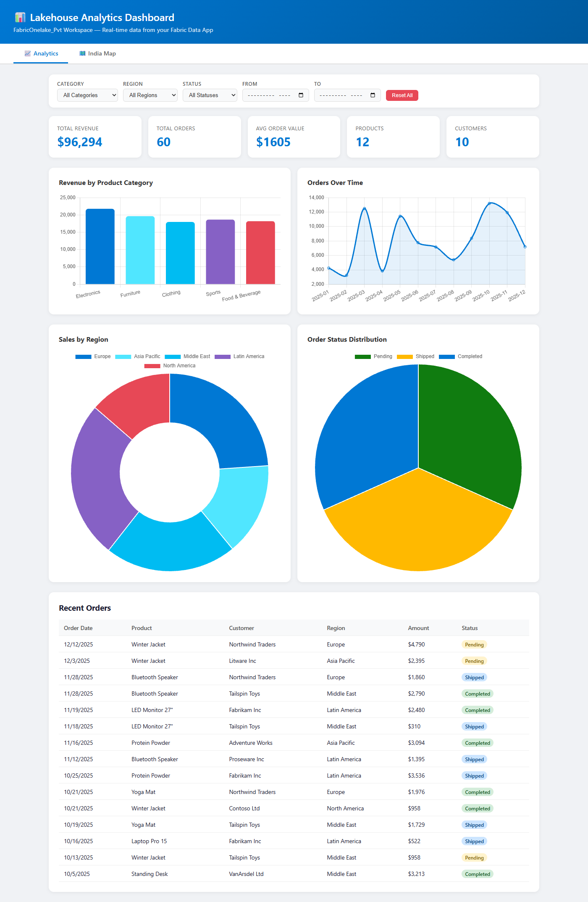
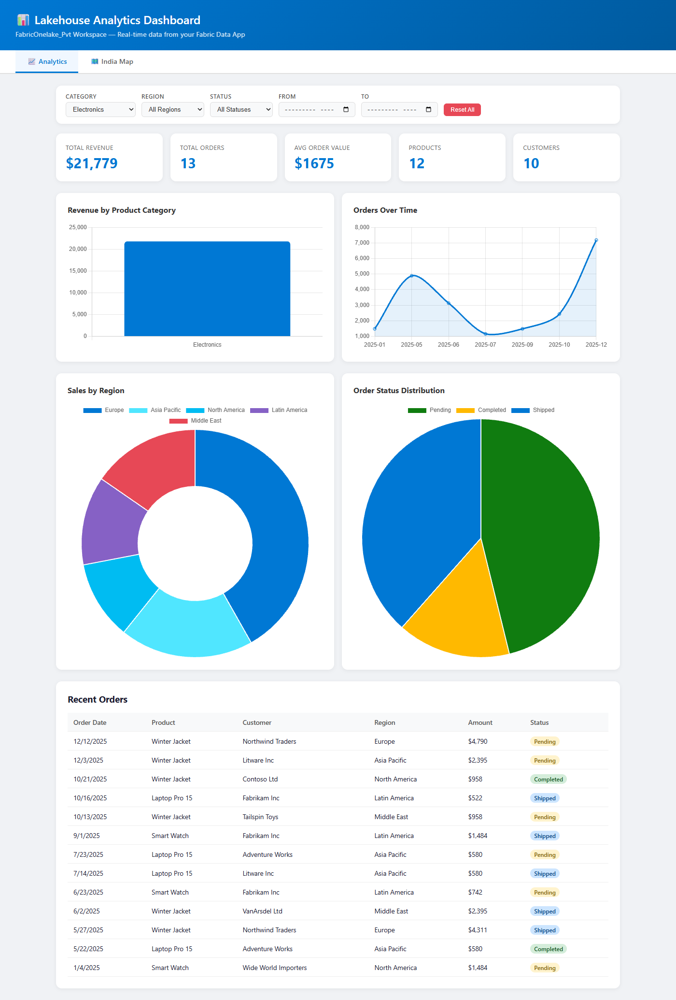
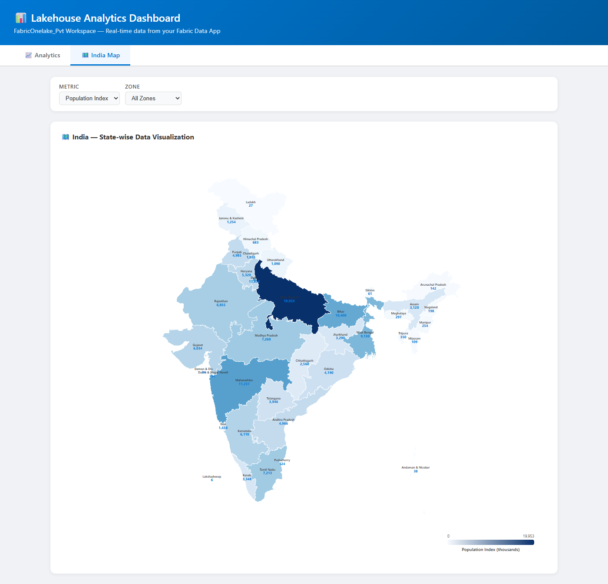
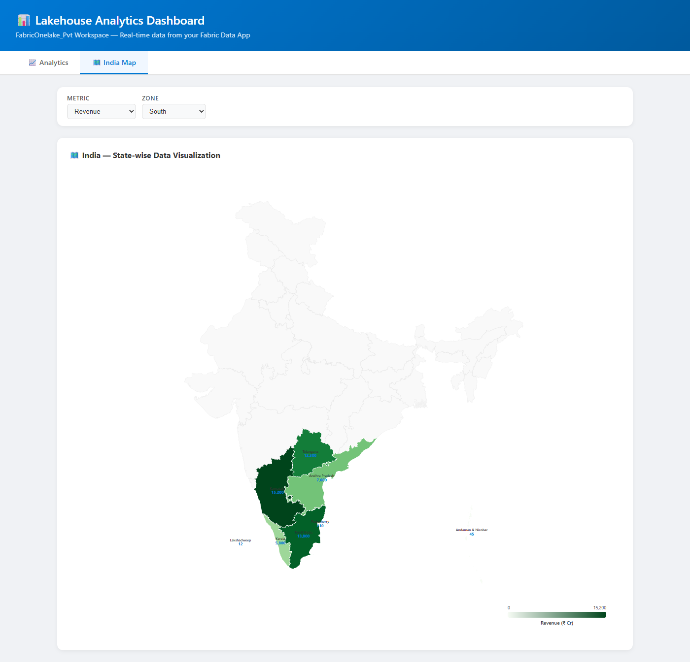

# DemoApp — Lakehouse Analytics Dashboard

A full-stack Fabric Data App built with **Rayfin** that visualizes lakehouse-style analytics data with interactive charts and an India state-level choropleth map.


---

## 📋 Table of Contents

- [Features](#features)
- [Architecture](#architecture)
- [Prerequisites](#prerequisites)
- [Environment Setup](#environment-setup)
- [Step-by-Step Deployment Guide](#step-by-step-deployment-guide)
- [Project Structure](#project-structure)
- [Configuration Reference](#configuration-reference)
- [Troubleshooting](#troubleshooting)
- [License](#license)

---

## ✨ Features

### 📈 Analytics Dashboard


- **KPI Cards** — Total Revenue, Orders, Avg Order Value, Products, Customers
- **Bar Chart** — Revenue by Product Category
- **Line Chart** — Monthly Revenue Trend
- **Doughnut Chart** — Sales by Region
- **Pie Chart** — Order Status Distribution
- **Data Table** — 15 most recent orders
- **Slicer Filters** — Category, Region, Status, Date Range (From/To), Reset All

#### With Filters Applied


### 🗺️ India Map


- **Interactive Choropleth** — All 37 states/UTs rendered from TopoJSON
- **State Labels** — Name + numeric value on each state
- **Metric Slicer** — Switch between Population Index, Revenue, Order Count, Growth %
- **Zone Slicer** — Filter by North, South, East, West, Central, North East
- **Hover Tooltips** — Detailed state info on hover
- **Color Legend** — Dynamic gradient legend per metric

#### With Zone & Metric Filter


---

## 🏗️ Architecture

```
┌─────────────────────────────────────────────────────────┐
│                  Microsoft Fabric Portal                  │
├─────────────────────────────────────────────────────────┤
│  ┌──────────────┐  ┌──────────────┐  ┌──────────────┐  │
│  │  Static Web  │  │  Rayfin API  │  │ SQL Database │  │
│  │  (Vite/TS)   │──│  (GraphQL)   │──│   (MSSQL)    │  │
│  └──────────────┘  └──────────────┘  └──────────────┘  │
├─────────────────────────────────────────────────────────┤
│  Fabric Capacity (F2+) — Central India / Supported Region│
└─────────────────────────────────────────────────────────┘
```

---

## 📦 Prerequisites

### 1. Microsoft Fabric Access
- [ ] Microsoft Fabric tenant with **active capacity (F2 or higher)**
- [ ] Workspace with **Contributor** or **Admin** role assigned to deploying user
- [ ] **Data App (AppBackend)** workload enabled in Fabric Admin Portal → Tenant Settings
- [ ] Capacity must be in a [supported region](https://learn.microsoft.com/en-us/fabric/admin/region-availability) (e.g., Central India, East US, West US 2, South Central US)

### 2. Development Machine
- [ ] **Node.js** v18+ (LTS recommended) — [Download](https://nodejs.org/)
- [ ] **npm** v9+ (comes with Node.js)
- [ ] **Git** — [Download](https://git-scm.com/)
- [ ] **TypeScript** 5.8+ (installed as dev dependency)
- [ ] Modern web browser (Edge/Chrome recommended)

### 3. Accounts & Permissions
- [ ] Microsoft Entra ID (Azure AD) account with Fabric access
- [ ] Permission to create items in the target workspace
- [ ] (Optional) GitHub account for source control

---

## 🛠️ Environment Setup

### Step 1: Install Node.js

```bash
# Verify installation
node --version   # Should show v18.x or higher
npm --version    # Should show v9.x or higher
```

### Step 2: Clone the Repository

```bash
git clone https://github.com/nikunj11itdhm/DemoApp.git
cd DemoApp
```

### Step 3: Install Dependencies

```bash
npm install
```

### Step 4: Verify Build

```bash
npx tsc -b && npx vite build
```

You should see output like:
```
✓ 627 modules transformed.
dist/index.html                  7.95 kB
dist/assets/index-XXXXXX.js    344.70 kB
✓ built in X.XXs
```

---

## 🚀 Step-by-Step Deployment Guide

### Phase 1: Fabric Admin Configuration

> ⚠️ **This must be done by a Fabric Admin before deployment.**

1. Go to **https://app.fabric.microsoft.com** → **Admin Portal**
2. Navigate to **Tenant Settings**
3. Search for **"Data App"** or **"App Backend"**
4. **Enable** the toggle for the target security group or entire organization
5. Ensure the target workspace is assigned to an **F2+ capacity** in a supported region
6. Wait 5–10 minutes for settings to propagate

### Phase 2: Authenticate

```bash
# Login to Fabric with your Entra ID account
npx rayfin login -t <YOUR_TENANT_ID>

# If you have multiple accounts, use the account picker:
npx rayfin login -t <YOUR_TENANT_ID> --select
```

**Verify login:**
```bash
npx rayfin login status
```

Expected output:
```
✅ Signed in successfully
   User:      user@yourtenant.onmicrosoft.com
   Tenant:    xxxxxxxx-xxxx-xxxx-xxxx-xxxxxxxxxxxx
```

### Phase 3: Deploy to Fabric

```bash
# Deploy everything — backend + database schema + static frontend
npx rayfin up -w "<YOUR_WORKSPACE_NAME>" -y
```

Replace `<YOUR_WORKSPACE_NAME>` with your exact Fabric workspace display name.

**Expected output on success:**
```
✔ Rayfin item ready (ID: xxxxxxxx-...)
✅ Configuration applied successfully!
✅ Static content deployed
  🌐 Hosting URL: https://xxxx-centralindia.webapp.fabricapps.net
```

### Phase 4: Verify Deployment

```bash
npx rayfin up status
```

This displays:
- Rayfin Item ID & workspace
- SQL Database connection
- Hosting URL
- Endpoint health status

### Phase 5: Seed Sample Data (Optional)

To populate the dashboard with sample data:

```bash
# Install tsx for running TypeScript directly
npm install -g tsx

# Run the seed script
npx tsx src/seed.ts
```

> **Note:** The seed script requires the `VITE_RAYFIN_API_URL` and `VITE_RAYFIN_PUBLISHABLE_KEY` environment variables. These are auto-generated in `.env.local` after deployment.

### Phase 6: Access the App

1. **Direct URL**: Open the hosting URL from the deployment output
2. **Fabric Portal**: Navigate to your workspace → find "demoapp" item → click to open
3. **Authentication**: Users sign in automatically via Fabric SSO (Entra ID)

---

## 📁 Project Structure

```
DemoApp/
├── rayfin/
│   ├── data/
│   │   ├── Product.ts          # Product entity (name, category, price, stock)
│   │   ├── Customer.ts         # Customer entity (name, region, segment)
│   │   ├── Order.ts            # Order entity (quantity, amount, status, date)
│   │   └── schema.ts           # Schema registration
│   ├── rayfin.yml              # Backend config (auth, data, static hosting)
│   └── tsconfig.json           # Rayfin compilation settings
├── src/
│   ├── main.ts                 # Dashboard + slicer logic + Chart.js visuals
│   ├── india-map.ts            # D3 choropleth map with TopoJSON
│   ├── seed.ts                 # Sample data seeder script
│   └── vite-env.d.ts           # Vite type declarations
├── public/
│   └── india-states.topo.json  # India TopoJSON (37 states/UTs)
├── index.html                  # App shell with tabs + slicer UI
├── package.json                # Dependencies & scripts
├── tsconfig.json               # Frontend TypeScript config
├── vite.config.ts              # Vite build configuration
└── AGENTS.md                   # Rayfin agent context
```

---

## ⚙️ Configuration Reference

### rayfin.yml

| Service | Setting | Description |
|---------|---------|-------------|
| `auth.enabled` | `true` | Enables authentication |
| `auth.fabric.enabled` | `true` | Enables Fabric SSO (Entra ID) |
| `data.enabled` | `true` | Enables SQL database + GraphQL API |
| `data.dialect` | `mssql` | SQL Server (required for Fabric) |
| `staticHosting.enabled` | `true` | Deploys frontend to Fabric |
| `staticHosting.folder` | `dist` | Vite build output directory |
| `staticHosting.buildCommand` | `npm run build` | Build command for frontend |

### Environment Variables (auto-generated after deploy)

| Variable | Description |
|----------|-------------|
| `VITE_RAYFIN_API_URL` | Backend API endpoint URL |
| `VITE_RAYFIN_PUBLISHABLE_KEY` | Public key for client auth |
| `VITE_FABRIC_ITEM_ID` | Fabric item identifier |

---

## 🔧 Troubleshooting

### "The feature is not available" (403)
**Cause:** Data App workload not enabled or unsupported region.
**Fix:**
1. Verify Fabric Admin has enabled the Data App feature in Tenant Settings
2. Ensure workspace capacity is in a [supported region](https://learn.microsoft.com/en-us/fabric/admin/region-availability)
3. Verify capacity is F2 or higher (not trial/shared)

### "Workspace not found" (404)
**Cause:** Workspace name doesn't match or wrong tenant.
**Fix:**
1. Use `npx rayfin login -t <TENANT_ID> --select` to pick the correct account
2. Verify exact workspace name (case-sensitive) in Fabric portal

### "Insufficient permissions" (403)
**Cause:** User doesn't have Contributor/Admin role on workspace.
**Fix:** Ask workspace admin to grant Contributor role.

### TypeScript build errors
**Fix:**
```bash
rm -rf rayfin/.temp node_modules/.cache
npx tsc -b --force
```

### Database schema not applying
**Fix:**
```bash
npx rayfin up db apply -y
```
If it fails with "Invalid token", wait 2–3 minutes for the workload to warm up and retry.

---

## 📜 NPM Scripts

| Script | Description |
|--------|-------------|
| `npm run dev` | Start local dev server (Vite + Rayfin backend) |
| `npm run build` | Production build (TypeScript + Vite) |
| `npm run preview` | Preview production build locally |
| `npm run rayfin:up` | Deploy to Fabric |

---

## 🔄 Updating the App

After making changes:

```bash
# Rebuild and redeploy only the frontend
npx vite build
npx rayfin up staticapp deploy --skip-build -y

# Or full deploy (backend + frontend)
npx rayfin up -w "<WORKSPACE_NAME>" -y
```

---

## 📄 License

ISC

---

## 🤝 Support

For issues with:
- **Rayfin CLI**: `npx rayfin docs search '<topic>' --module guide`
- **Fabric Admin**: [Microsoft Fabric documentation](https://learn.microsoft.com/en-us/fabric/)
- **This app**: Open an issue in this repository
